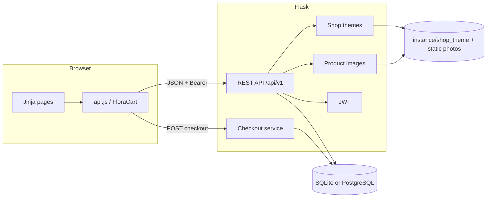
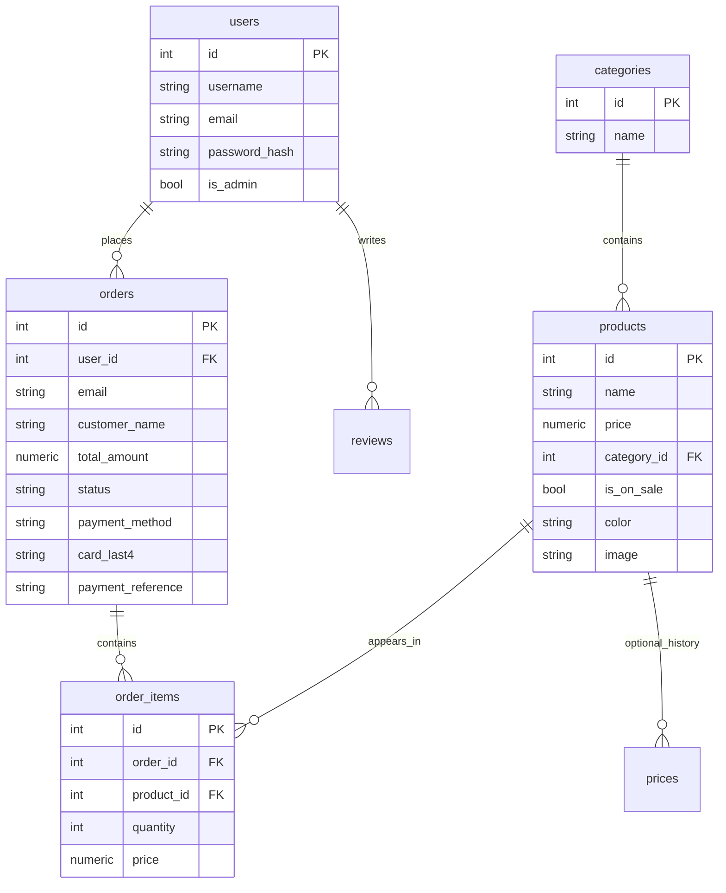
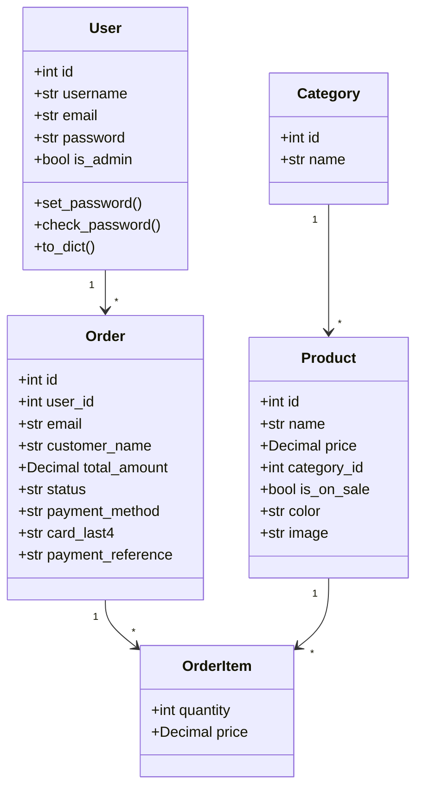
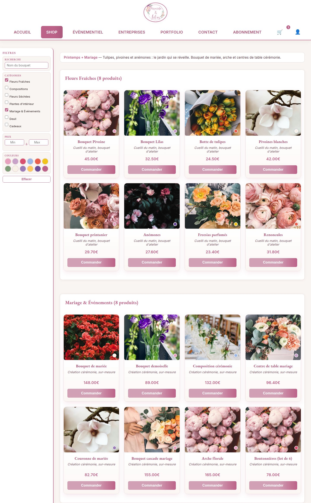
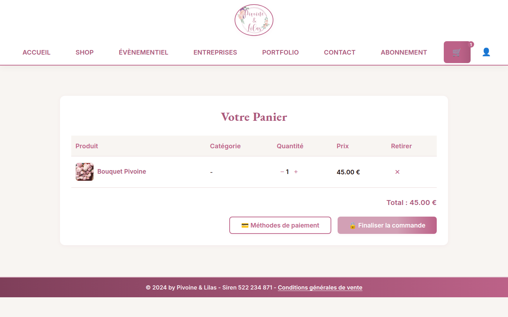
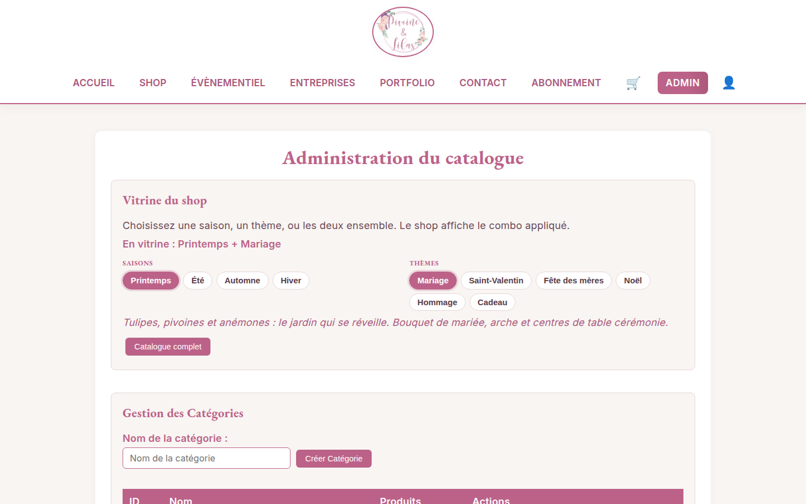

# Pivoine & Lilas

Online boutique for a florist in Sciez (Léman, Haute-Savoie). Customers browse bouquets with photos, filter by category or colour, subscribe to seasonal flowers, and pay online. The florist manages the catalog from a protected back-office, applies a season, a theme, or both as a combo to the live shop, and reviews paid orders with line prices and payment details.

The previous site was a Wix brochure that was no longer maintained. This application is the working shop: accounts, catalog, cart, server-side checkout, subscriptions, vitrine, and administration.

Source: [github.com/Issercio/Demo-day](https://github.com/Issercio/Demo-day)

---

## Team

| Name | Role | Responsibilities |
| --- | --- | --- |
| Issercio | Full-stack developer | Flask API, SQLAlchemy models, authentication, checkout, tests, security, documentation |
| Matthieu | Front-end & product | Storefront (Jinja, CSS, JavaScript), user stories, live demonstration, presentation |

---

## Getting started

Python 3.10+ is required. PostgreSQL is optional; SQLite is the default.

```bash
git clone https://github.com/Issercio/Demo-day.git
cd Demo-day
chmod +x setup.sh run.sh run-tests.sh
./setup.sh
./run.sh
```

`setup.sh` creates `Demoday/.venv`, installs `Demoday/requirements.txt`, copies `.env.example` to `Demoday/.env` if needed, and seeds demo users plus seven florist categories with product photos (Fleurs Fraîches, Compositions, Fleurs Séchées, Plantes d’intérieur, Mariage & Événements, Deuil, Cadeaux).

Manual equivalent:

```bash
cd Demoday
python3 -m venv .venv
source .venv/bin/activate
pip install -r requirements.txt
cp ../.env.example .env
python3 init_db.py
python3 run.py
```

| Page | URL |
| --- | --- |
| Home | http://localhost:5000/accueil.html |
| Shop | http://localhost:5000/shop.html |
| Cart | http://localhost:5000/panier.html |
| Checkout | http://localhost:5000/checkout.html |
| Admin | http://localhost:5000/admin.html |
| API (Swagger) | http://localhost:5000/api/v1 |

```bash
./run-tests.sh
```

If a hosted URL is unavailable, run the local SQLite demo with the accounts below. Test output is in [`docs/testing.md`](docs/testing.md) and [`docs/test-evidence/`](docs/test-evidence/).

### Environment

Copy [`.env.example`](.env.example) to `Demoday/.env`. Never commit `.env`. Secrets are listed in `.gitignore`.

| Variable | Example | Role |
| --- | --- | --- |
| `DATABASE_URL` | `sqlite:///florashop.db` | SQLAlchemy URI |
| `SECRET_KEY` | long random string | Flask and JWT signing |
| `JWT_SECRET_KEY` | long random string | Reserved JWT secret |
| `STRIPE_SECRET_KEY` | empty | Leave empty to use test cards |
| `STRIPE_PUBLISHABLE_KEY` | empty | Leave empty for the classroom demo |

### Demo accounts

| Role | Name | Email | Password |
| --- | --- | --- | --- |
| Customer | Marie Dupont | `marie@test.com` | `marie123` |
| Customer | Léa Martin | `client@test.com` | `client123` |
| Florist (admin) | Camille Pivoine | `admin@florashop.com` | `admin123` |

Successful payment: `4242 4242 4242 4242`, any future expiry, CVC `123`.  
Declined: `4000 0000 0000 0002`. Insufficient funds: `4000 0000 0000 9995`.

---

## Implemented user stories

| Role | Story | Priority |
| --- | --- | --- |
| Customer | Create an account and log in to place orders | Must have |
| Customer | Browse products by category, with photos and colour swatches | Must have |
| Customer | Order flowers online and pay | Must have |
| Customer | Keep a cart that does not leak to another account | Must have |
| Customer | Subscribe to a floral plan (monthly, semester, yearly) | Should have |
| Customer | Filter the catalog by minimum and maximum price | Shop filter |
| Customer | See the season, theme, or combo vitrine applied by the florist | Shop filter |
| Florist | Add, update and delete products and categories | Must have |
| Florist | Upload a product photo from the catalog form | Must have |
| Florist | Apply a season, a theme, or both as a combo to the live shop | Must have |
| Florist | Create or delete shop event themes from the admin catalog | Must have |
| Florist | Review paid orders with line prices, card last four digits, and payment reference | Must have |
| Florist | Keep the back-office for administrators only | Must have |

Evidence: `/account.html`, `/shop.html`, `/checkout.html`, `/subscription.html`, `/admin.html` (Vitrine du shop, catalogue photos, Commandes et paiements), and the REST routes under `/api/v1`.

---

## Missing user stories

These were in the original specification and are not in this release.

| Role | Story | Priority | Current state |
| --- | --- | --- | --- |
| Customer | Click-and-collect time slot | Must have | The order is paid; there is no pickup window |
| Customer | Delivery limited to configured zones | Must have | No postcode or zone table |
| Customer | Email alerts for events and sales | Could have | Password-reset pages are interface only |
| Florist | Edit homepage images and seasonal copy | Must have | Home is a template; seasons and themes are applied from admin to the shop, not to `/accueil.html` |
| Florist | Configure delivery areas | Must have | Not modelled |
| Florist | Enforce minimum and maximum catalog prices as rules | Must have | Admin sets a price; min/max in the shop is a filter |
| Florist | Publish blog posts and workshops | Should have | `/evenementiel.html` is static |
| Customer | Write product reviews | Specified | `reviews` model exists; endpoints are not mounted |

---

## Known bugs and limitations

Resolved:

- Empty cart on the payment page after per-account cart keys — checkout loads the shared cart script and a snapshot
- `marie@test.com` rejected on legacy bcrypt hashes — login accepts bcrypt and the demo seed repairs unusable hashes
- Cart shared between accounts — keys are `cart:user:<id>` and `cart:guest`
- Checkout trusted prices sent by the browser — totals come from the database
- Money stored as binary `float` — columns are `Numeric(10, 2)`, totals use `Decimal`
- Fixed navigation covering content — sticky header in document flow
- Profile / logout menu stretching the navbar — compact overlay under the account icon
- Empty shop on a fresh database — demo bouquets, compositions and photos are seeded on startup
- Season picker on the public homepage — moved to admin **Vitrine du shop**; the shop reads `GET /api/v1/themes`
- Admin orders shown as a one-line table — each order is a card with items, unit price, line total, status, and payment metadata
- Virtualenv and a Stripe publishable key in Git — removed

Open, none of them block a purchase:

- Forgot-password and verify-code pages do not send email
- Reviews API is not registered
- The cart lives in `localStorage`, not in a server table
- The `prices` table is unused (`products.price` is the source of truth)
- Duplicate CSS and leftover debug prints
- No production host in this repository (local demo)
- CORS allow-list is localhost
- Package coverage is pulled down by unused modules; checkout, authentication, vitrine and catalog paths are covered

---

## Architecture



The browser renders server templates and calls `/api/v1`. Checkout never uses a price from the client: `checkout_service.build_order_lines` loads `Product.price` from the database and totals with `Decimal`.

The public shop does not auto-filter `GET /api/v1/products`. After load it reads `GET /api/v1/themes` (`applied_ids`, `product_names`) and shows the florist’s vitrine. A combo is the union of the season list and the event list. Applied ids are stored as a comma-separated string (`printemps,mariage`), not with `+`, so they stay URL-safe.

**Frontend.** Templates in `Demoday/app/templates/` (home, shop, cart, checkout, account, admin, subscription). Shared CSS in `static/css/style.css`. Cart and session in `static/js/api.js`. Vanilla JavaScript and Jinja — no React.

**Backend.** `create_app()` in `app/__init__.py` wires CORS, SQLAlchemy, Flask-RESTX namespaces (`auth`, `products`, `categories`, `users`) and the payments blueprint. Domain logic lives in `app/services/` (`checkout_service.py`, `demo_accounts.py`, `shop_themes.py`, `product_images.py`, `stripe_service.py`). The applied vitrine is persisted under `Demoday/instance/shop_theme` (overridable with `SHOP_THEME_PATH` in tests).

---

## Database

Money columns use `Numeric(10, 2)`. JSON still exposes numbers at the HTTP boundary; storage and totals are decimals.



`reviews` and `prices` exist as models but are not on the purchase path. Product `color` is a hex code (`VARCHAR(7)`). Product `image` is a path under `/static/img/products/`. Card numbers are not stored; `card_last4` is at most four digits.

The shop vitrine is not a SQL table. Seasons and event themes live in `shop_themes.py`. The florist’s current choice is a JSON file `{ "season": "...", "theme": "..." }`.

### UML



---

## API

Interactive documentation: http://localhost:5000/api/v1  
Postman: [`docs/postman/FloraShop.postman_collection.json`](docs/postman/FloraShop.postman_collection.json)

| Method | Path | Auth | Purpose |
| --- | --- | --- | --- |
| POST | `/api/v1/auth/register` | public | Create user, return JWT |
| POST | `/api/v1/auth/login` | public | Sign in |
| GET | `/api/v1/products` | public | Full catalog (`?theme=` season, event, or comma-separated combo) |
| GET | `/api/v1/themes` | public | Seasons, event themes, and the applied shop vitrine |
| POST | `/api/v1/themes` | admin JWT | Create a custom event theme (not a season) |
| PUT | `/api/v1/themes` | admin JWT | Apply `{ "season", "theme" }` or a legacy `{ "id" }` |
| DELETE | `/api/v1/themes/<id>` | admin JWT | Delete an event theme (Mariage, a custom one, etc.). Seasons stay. |
| POST | `/api/v1/products` | admin JWT | Create product (JSON or multipart with `image`) |
| PUT / DELETE | `/api/v1/products/<id>` | admin JWT | Update or delete product (multipart photo allowed on PUT) |
| GET | `/api/v1/categories` | public | List categories |
| POST / PUT / DELETE | `/api/v1/categories`… | admin JWT | Mutate categories |
| GET | `/api/v1/users` | admin JWT | List users (no password field) |
| GET | `/api/v1/payments/config` | public | `test` or `stripe` mode |
| POST | `/api/v1/payments/checkout` | optional JWT | Create a paid or failed order |
| GET | `/api/v1/payments/orders/<id>` | owner or admin JWT | Order detail |
| GET | `/api/v1/payments/orders` | admin JWT | List orders |

`GET /api/v1/themes` returns `applied`, `applied_ids`, `applied_season`, `applied_theme`, `label`, `blurb`, `product_names`, and the full theme list with `is_applied` and `can_delete`. A customer token cannot change the vitrine. Event themes can be removed; seasons cannot.

---

## Authentication and security

- Passwords are hashed with Werkzeug. Legacy bcrypt and leftover plaintext are verified, then upgraded.
- Login and register return a JWT (HS256) stored in `localStorage` and sent as `Authorization: Bearer`.
- Claims: `sub`, `email`, `is_admin`, `exp`.
- The admin page is hidden in the browser **and** every mutation is checked on the server. A customer token cannot create categories, upload photos, change the vitrine, or list all orders.
- Authorization uses the `is_admin` column in the database, not the JWT claim. A forged `is_admin: true` token is ignored.
- Example / placeholder `SECRET_KEY` values from the repository are rejected at startup; the process generates a random signing key instead.
- User JSON never includes `password`. Creating or updating a user cannot mint an administrator.
- Checkout totals come from the database. Unknown Luhn-valid cards are declined. A logged-in checkout uses the account email, not a spoofed body field.
- Order detail is limited to the owner or an admin; the order list is admin-only.
- Card numbers are not stored; at most `card_last4`.
- Product photo uploads are admin-only. Allowed types: jpg, png, webp, gif. Maximum size: 4 MB.
- Stripe keys live only in the environment. Empty keys use documented test cards. No live charge in the default demo.
- CORS is limited to localhost.
- `.env` is gitignored; only `.env.example` is committed.

Remaining risks: JWT in `localStorage` (XSS), no CSRF on cookie-less Bearer, no login rate limit. PayPal and saved-card checkouts are sandbox (no live money movement). Flask binds `0.0.0.0:5000` for the classroom demo; the debugger stays off unless `FLASK_DEBUG=1`.

---

## Stack

| Layer | Choice |
| --- | --- |
| Frontend | HTML5, CSS3, vanilla JavaScript, Jinja2 |
| Backend | Python 3.10+, Flask 3, Flask-RESTX, Flask-Migrate |
| Auth | PyJWT (HS256), Werkzeug hashes, bcrypt for legacy rows |
| Database | SQLite locally, PostgreSQL when `DATABASE_URL` points to it |
| ORM | SQLAlchemy 2, `Numeric(10, 2)` for money |
| Payments | Built-in test processor, optional Stripe |
| Tests | `unittest`, `coverage` |
| Config | python-dotenv, Flask-CORS, Alembic |

Flask and Jinja keep pages and API in one process. RESTX provides Swagger. SQLite keeps a classroom machine free of PostgreSQL. Decimal types are the correct way to store euros. Test cards make the demonstration work without secrets.

**Decisions.** Server-side checkout. Per-user carts after a shared-cart bug. Sticky navigation instead of a floating bar. Profile menu as an overlay under the account icon. Demo users, bouquets and photos re-seeded so `marie@test.com` / `marie123` and `/shop.html` always work. Vitrine controls live in admin, not on the homepage, so every visitor sees the same shop. Season and event can be combined; the shop shows the union of both product lists. Admin orders are cards, not a one-line table, so the florist can read unit price, quantity and payment metadata.

---

## Testing

Strategy and evidence: [`docs/testing.md`](docs/testing.md). Last captured run: **61 tests OK** in [`docs/test-evidence/`](docs/test-evidence/).

Covered: registration and login hashing, demo seed (accounts, seven-category flower catalog, product photos), admin versus customer permissions, public catalog, product image upload (admin only, rejected for clients and non-images), checkout (success, decline, insufficient funds, unknown Luhn card, invalid PAN, PayPal, saved card, subscription line, server-side prices, decimal cents, admin order list with item prices, order IDOR, spoofed email), vitrine (admin-only `PUT /themes`, shop payload, season/theme combo `printemps,mariage`), privilege escalation (forged JWT, placeholder secret, POST/PUT/register cannot mint admin).

Not covered yet: live Stripe calls, email, browser end-to-end tests, reviews, load tests.

---

## Challenges and how they were solved

| Challenge | Kind | Resolution |
| --- | --- | --- |
| Front-end and API disagreed on cart identity | Technical | One `FloraCart` helper, per-account keys, checkout snapshot |
| Mixed password hashes in `users.password` | Technical | `check_password` accepts Werkzeug, bcrypt and plaintext; demo seed repairs Marie |
| Stripe keys missing in the classroom | Technical | Documented test cards when environment keys are empty |
| Money rounding | Technical | `Decimal` and `Numeric(10, 2)`; admin line totals in cents |
| Logout menu stretched the navbar | Technical | Dropdown overlay under the account icon; leftover fixed-header padding removed |
| Empty shop after a clean SQLite start | Technical | Seed seven florist categories with photos and hex colors that match the shop filter swatches |
| Season picker on the homepage confused visitors | Product | Move **Vitrine du shop** to admin; public `GET /themes` updates `/shop.html` for everyone |
| Season *and* event at the same time | Product | Persist `{season, theme}`; combo ids are comma-separated; shop shows the union |
| Admin orders too sparse to demo a payment | Product | Order cards with French status, client or guest, last four digits, reference, photo, quantity, unit price, line total |
| Rebuilding every Wix page versus a working shop | Product | Cut CMS, geo and email; keep the purchase path |
| Presentation time including the live demo | Organisation | Timed story; skip the declined card if the clock runs out |

Difficult moments in code: empty checkout after cart keys became user-scoped; Marie locked out by bcrypt; binary floats; a committed virtualenv and a leftover Stripe key; the profile panel opening a gap under the header; applying a vitrine on the homepage instead of the shop; `+` in combo ids breaking query strings.

---

## Collaboration

Work lives on [Issercio/Demo-day](https://github.com/Issercio/Demo-day), branch `main`. Feature work is tested with `./run-tests.sh` before merge.

To show how the project is organised:

- GitHub history and this README
- [`docs/test-evidence/unittest-output.txt`](docs/test-evidence/unittest-output.txt)
- Swagger at `/api/v1` and the Postman collection
- Storefront captures in [`docs/screenshots/`](docs/screenshots/) (home, shop, vitrine, cart, account, checkout, admin)

Issercio and Matthieu share this repository. Cadence for a demonstration: one local server, credentials written above, a fallback of tests plus this file if a deploy is down.

---

## What we would improve

- Store the cart on the server
- Click-and-collect slots and delivery zones
- Real email for receipts and password reset
- Seasonal editing of the homepage (the shop vitrine already exists)
- Playwright end-to-end tests
- PostgreSQL in CI
- A hosted instance and a recorded walkthrough as backup
- Remove or test leftover modules (`prices`, unmounted reviews) so coverage reflects the live code

---

## What we learned

**Technical.** Never trust a price from the browser. Store money as decimals. Support legacy password hashes or the demo account locks. An empty Stripe key must not crash checkout. Secrets do not belong in Git. A dropdown must overlay the page, not stretch the header. A shop-wide theme belongs in admin, not on the marketing homepage, and combo ids must stay URL-safe.

**Non-technical.** A demonstration needs a story, not a click tour. Features that were specified and not built must be listed, or they look like defects. Twenty minutes including the demo forces cuts. Documentation is part of the product.

---

## Live demonstration

Marie forgot her mother’s birthday. The boutique in Sciez is closed. She opens Pivoine & Lilas.

1. Home — the boutique is open online (address and hours; no theme picker).
2. Sign in as `admin@florashop.com` / `admin123`. Open **Vitrine du shop**. Apply **Automne**, or a combo such as **Printemps + Mariage**. Open `/shop.html` (or **SHOP** in another tab): the catalog follows that vitrine for every visitor. Reset filters does not clear the vitrine. **Catalogue complet** in admin restores the full shop. A cross on an event theme (Mariage, Noël, or a theme you created) removes it; seasons stay.
3. Shop as a customer — filter a category or a colour swatch, add one bouquet with its photo (Fleurs Fraîches, Compositions, Fleurs Séchées, Plantes, Mariage, Deuil, Cadeaux; product hex colors match the filter bar).
4. Sign in as `marie@test.com` / `marie123`. The cart is hers. Open the account icon: email and **Déconnexion** sit under the icon, the navbar does not grow.
5. Pay with `4242 4242 4242 4242`. The server recalculates the total. Status `paid`.
6. Optionally add *Éclat Mensuel* (€19.99).
7. Optionally show a declined card (`4000 0000 0000 0002`).
8. Back as the florist. Create a product with a photo. Open **Commandes et paiements**: Marie’s order is a card with French status, client account, card last four digits, payment reference, each line’s photo, category, quantity, unit price and line total.

If the interface fails: Swagger at `/api/v1` and `./run-tests.sh` still show checkout, authentication, vitrine and admin guards.

The spoken presentation, including this walkthrough, stays inside **20 minutes**.

---

## Conclusion

Pivoine & Lilas is a florist shop that takes a real order: a customer can sign in, buy a photographed bouquet, pay, subscribe, and the florist can manage the catalog, set the live vitrine, and read the payment on an order card. The server owns the price. What is not built (click-and-collect, homepage CMS, delivery zones, email) is listed here. The next work is operations, not another visual pass.

Screenshots:

| Page | Capture |
| --- | --- |
| Home | [accueil.png](docs/screenshots/accueil.png) |
| Shop | [shop.jpg](docs/screenshots/shop.jpg) |
| Shop vitrine (Printemps + Mariage) | [shop-vitrine.jpg](docs/screenshots/shop-vitrine.jpg) |
| Cart | [panier.png](docs/screenshots/panier.png) |
| Account | [account.png](docs/screenshots/account.png) |
| Profile menu | [account-menu.png](docs/screenshots/account-menu.png) |
| Checkout | [checkout.png](docs/screenshots/checkout.png) |
| Admin vitrine | [admin-vitrine.png](docs/screenshots/admin-vitrine.png) |
| Admin catalog | [admin-catalog.png](docs/screenshots/admin-catalog.png) |
| Admin orders | [admin-orders.png](docs/screenshots/admin-orders.png) |








---

## Authors

- **Issercio** — [github.com/Issercio](https://github.com/Issercio)
- **Matthieu**
