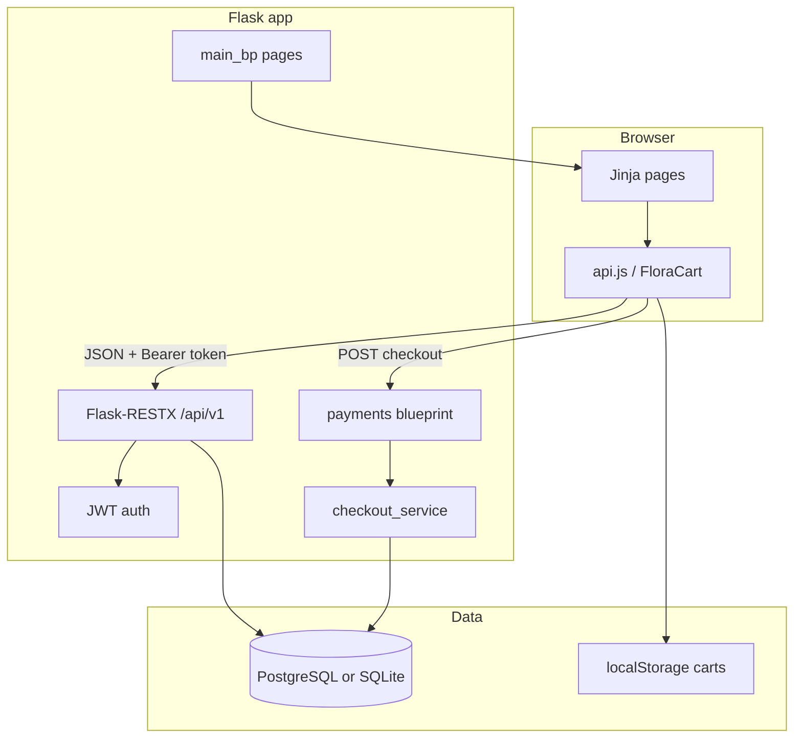
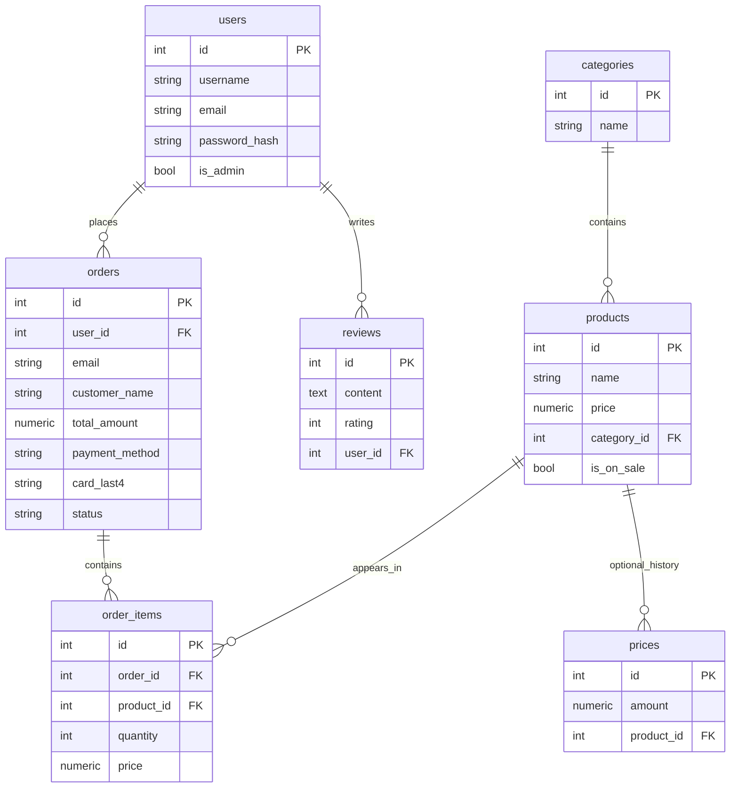
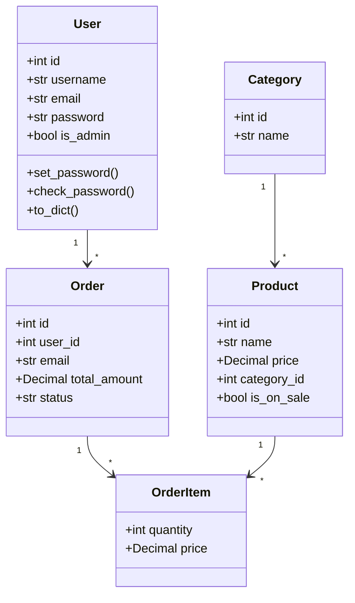

# Pivoine & Lilas (FloraShop)

Online florist shop for the Demo Day evaluation. The live storefront is a Flask application: catalog, subscriptions, per-account cart, JWT authentication, and **server-side checkout**. Money is stored as `Numeric(10, 2)` / `Decimal`, not binary `float`.

**Repository:** [https://github.com/Issercio/Demo-day](https://github.com/Issercio/Demo-day)

**Live demo:** run locally with `./setup.sh` then `./run.sh` → [http://localhost:5000/accueil.html](http://localhost:5000/accueil.html)

**Backup plan:** if a hosted URL is unavailable, use the local SQLite demo (credentials below) and the test evidence in [`docs/testing.md`](docs/testing.md). Interactive Swagger is at `/api/v1`.

---

## Description

Pivoine & Lilas is a boutique flower e-commerce site. Visitors browse bouquets and subscription plans, keep a cart that does not leak between accounts, and pay through a real order pipeline. Without Stripe keys the app uses a documented test-card processor (Luhn + Stripe test PANs). With Stripe keys it can confirm PaymentIntents.

The project solves the usual school-shop gaps: passwords are hashed, catalog prices are taken from the database (not from the browser), and secrets stay out of Git.

---

## Team

| Name | Role | Responsibilities |
| --- | --- | --- |
| **Issercio** | Full-stack student developer | Flask API, SQLAlchemy models, Jinja/CSS storefront, JWT auth, checkout/payments, demo accounts, tests, documentation |

---

## Features

- Public pages: home, shop, subscriptions, events, companies, contact, CGV, portfolio
- Product catalog with categories and sale flags
- Flower subscriptions (monthly / semester / yearly) as catalog products
- Register, login, JWT session in `localStorage`
- **Per-account cart** (`cart:user:<id>` vs `cart:guest`) so accounts do not share items
- Checkout form with card / PayPal / saved-card paths
- Server-side order creation (`orders` + `order_items`)
- Test cards: `4242…4242` success, `4000…0002` declined, `4000…9995` insufficient funds
- Optional Stripe PaymentIntent when real keys are configured
- Admin-only catalog and user-list mutations
- Swagger UI for the REST API
- Demo users seeded on startup (hashed passwords)

---

## Technologies

| Layer | Choice |
| --- | --- |
| Frontend | HTML5, CSS3, vanilla JavaScript (`api.js`, FloraCart), Jinja2 templates |
| Backend | Python 3.10+, Flask 3, Flask-RESTX, Flask-Migrate |
| Auth | PyJWT (HS256), Werkzeug password hashes (scrypt/pbkdf2), bcrypt for legacy hashes |
| Database | PostgreSQL in production-style deploys; SQLite for local/eval/tests |
| ORM | SQLAlchemy 2, `Numeric(10, 2)` for money |
| Payments | Built-in test processor + optional Stripe SDK |
| Tests | `unittest`, `coverage` |
| Tools | python-dotenv, Flask-CORS, Alembic migrations |
| Deployment | `python run.py` on `0.0.0.0:5000` (container/VM or local) |

---

## Architecture



The browser renders server templates and calls `/api/v1`. Authentication issues a JWT (`sub`, `email`, `is_admin`, `exp`). Checkout never trusts client prices: `checkout_service.build_order_lines` loads `Product.price` from the database and totals with `Decimal`.

**Frontend structure:** templates in `Demoday/app/templates/` (accueil, shop, panier, checkout, account, admin, …). Shared CSS in `static/css/style.css` (sticky header, document flow — no CSS `float` layout). Cart logic in `static/js/api.js`.

**Backend structure:** `create_app()` in `app/__init__.py` wires CORS, SQLAlchemy, RESTX namespaces (`auth`, `products`, `categories`, `users`) and the payments blueprint. Domain logic lives in `app/services/` (`checkout_service.py`, `demo_accounts.py`, `stripe_service.py`).

---

## Database

Money columns use `Numeric(10, 2)`. JSON responses still expose JavaScript numbers at the HTTP boundary; storage and totals are decimals.



`reviews` and `prices` exist as models but are not on the hot path (catalog price is `products.price`).

### UML — main classes



---

## API Documentation

Interactive docs: [http://localhost:5000/api/v1](http://localhost:5000/api/v1) (Swagger).

Postman collection: [`docs/postman/FloraShop.postman_collection.json`](docs/postman/FloraShop.postman_collection.json)

| Method | Path | Auth | Purpose |
| --- | --- | --- | --- |
| POST | `/api/v1/auth/register` | public | Create user, hash password, return JWT |
| POST | `/api/v1/auth/login` | public | Login (case-insensitive email) |
| GET | `/api/v1/products` | public | List catalog |
| POST | `/api/v1/products` | admin JWT | Create product |
| PUT/DELETE | `/api/v1/products/<id>` | admin JWT | Update / delete product |
| GET | `/api/v1/categories` | public | List categories |
| POST/PUT/DELETE | `/api/v1/categories`… | admin JWT | Mutate categories |
| GET | `/api/v1/users` | admin JWT | List users (no password field) |
| GET | `/api/v1/users/<id>` | self or admin | User profile |
| GET | `/api/v1/payments/config` | public | `test` vs `stripe` mode |
| POST | `/api/v1/payments/checkout` | optional JWT | Create paid/failed order |
| GET | `/api/v1/payments/orders` | admin JWT | List orders |

---

## Installation

**Requirements:** Python 3.10+, pip. PostgreSQL is optional (SQLite is the default in `.env.example`).

```bash
git clone https://github.com/Issercio/Demo-day.git
cd Demo-day
chmod +x setup.sh run.sh run-tests.sh
./setup.sh
```

The script creates `Demoday/.venv`, installs `Demoday/requirements.txt`, copies `.env.example` → `Demoday/.env` if needed, and seeds demo users.

Manual equivalent:

```bash
cd Demoday
python3 -m venv .venv
source .venv/bin/activate
pip install -r requirements.txt
cp ../.env.example .env
python3 init_db.py
```

---

## Environment Variables

See [`.env.example`](.env.example). **Do not commit `.env`.**

| Variable | Example (fake) | Role |
| --- | --- | --- |
| `DATABASE_URL` | `sqlite:///florashop.db` | SQLAlchemy URI |
| `DB_PASSWORD` | `change-me-db-password` | PostgreSQL password if used |
| `SECRET_KEY` | `change-me-to-a-long-random-string-min-32-chars` | Flask + JWT signature |
| `JWT_SECRET_KEY` | `change-me-to-another-long-random-string` | Reserved / config.py |
| `ADMIN_TOKEN` | `change-me-admin-token` | Legacy admin header |
| `STRIPE_SECRET_KEY` | empty | Stripe secret; empty = test cards |
| `STRIPE_PUBLISHABLE_KEY` | empty | Stripe publishable key |
| `STRIPE_WEBHOOK_SECRET` | empty | Stripe webhooks |

**How secrets are managed:** real values live only in `Demoday/.env` (gitignored). Git tracks `.env.example` with placeholders. Stripe keys are never hardcoded. An unused template that contained a Stripe publishable key was removed from the repository.

---

## Run the Project

```bash
./run.sh
# or:
cd Demoday && source .venv/bin/activate && python3 run.py
```

- Storefront: http://localhost:5000/accueil.html
- Shop: http://localhost:5000/shop.html
- Cart: http://localhost:5000/panier.html
- Checkout: http://localhost:5000/checkout.html
- Admin: http://localhost:5000/admin.html
- API: http://localhost:5000/api/v1

```bash
./run-tests.sh
# or:
cd Demoday && source .venv/bin/activate && python3 -m unittest discover -s tests -v
```

---

## Demo Credentials

Safe classroom accounts, re-hashed on each app start if needed:

| Role | Email | Password |
| --- | --- | --- |
| Client | `marie@test.com` | `marie123` |
| Client | `client@test.com` | `client123` |
| Admin | `admin@florashop.com` | `admin123` |

Test payment card (success): `4242 4242 4242 4242`, expiry any future `MM/YY`, CVC `123`.

---

## Screenshots

Architecture, ERD, and UML diagrams are in the sections above (Mermaid). After a local launch, the main screens are:

1. Home — `/accueil.html`
2. Shop catalog — `/shop.html`
3. Cart — `/panier.html`
4. Checkout — `/checkout.html`
5. Swagger — `/api/v1`

Automated proof (terminal + coverage) is stored in [`docs/test-evidence/`](docs/test-evidence/) and summarized in [`docs/testing.md`](docs/testing.md).

---

## Project Management

Work is tracked in this GitHub repository: [Issercio/Demo-day](https://github.com/Issercio/Demo-day).

Typical workflow: feature branch (`cursor/…`) → automated tests → pull request into `main` → merge when the Demo Day slice is stable. Demo-day evaluation docs and test evidence live on the default branch.

---

## Known Issues

Documented during testing. **Fixed** items are kept so evaluators can see what was already resolved.

| Issue | Status |
| --- | --- |
| Empty cart on the payment page after per-account `localStorage` keys | **Fixed** — checkout loads `api.js` and a sessionStorage snapshot |
| `marie@test.com` failed to log in on bcrypt `$2b$` hashes | **Fixed** — `User.check_password` accepts bcrypt and demo seed resets unusable hashes |
| Cart shared across accounts | **Fixed** — `cart:user:<id>` / `cart:guest` |
| Checkout ignored DB prices / Stripe `KeyError` | **Fixed** — `checkout_service` + test cards |
| Binary `float` money columns | **Fixed** — `Numeric(10, 2)` + `Decimal` totals |
| Fixed navbar covering content (`position: fixed`) | **Fixed** — sticky header in document flow |
| `venv/` and a Stripe `pk_test_…` key were in Git | **Fixed** — untracked + unused file deleted |
| Forgot-password / verify-code pages do not send email | **Open** — UI only |
| Reviews API is not registered in `create_app` | **Open** — model exists, no live endpoints |
| Cart is browser `localStorage`, not a server table | **Open** — lost if the user changes browser |
| `prices` table unused (source of truth is `products.price`) | **Open** — leftover model |
| Duplicate CSS blocks in `style.css` | **Open** — both nav rules are sticky; cleanup remaining |
| Debug `print` statements in some API handlers | **Open** — noisy in logs, not a functional bug |
| No production host in this repo | **Open** — demo is local; backup is tests + this README |
| CORS allow-list is localhost only | **Open** — expected for local eval |

---

## Authors

- **Issercio** — [github.com/Issercio](https://github.com/Issercio)

---

## Testing

See **[docs/testing.md](docs/testing.md)** for strategy, coverage, what is not tested yet, and the manual test table.

Latest automated run: **22 tests OK**. Terminal log and coverage: **[docs/test-evidence/](docs/test-evidence/)**.

**Covered today:** login/register hashing, demo account seed, admin vs client permissions, public catalog, checkout (success, decline, insufficient funds, invalid PAN, PayPal, subscription line, server-side prices, decimal cents, admin order list).

**Not covered yet:** real Stripe network calls, email reset, browser end-to-end (Playwright/Cypress), reviews, CSRF on cookie-less JWT, load testing.

---

## Security

1. `.env` is gitignored; only `.env.example` is committed.
2. Passwords are hashed (Werkzeug). Legacy plaintext/bcrypt hashes are verified then upgraded.
3. JWT in `Authorization: Bearer`; `is_admin` is read from the token but mutations still load the user where required.
4. Admin catalog/user-list routes return 401/403 for anonymous and client tokens.
5. User JSON never includes `password`.
6. Checkout totals come from the database.
7. Stripe keys are environment-only; empty keys → test processor (no live charges).

---

## Technical Explanations

**Stack choices.** Flask + Jinja keeps one Python process for pages and API, which matches a small Demo Day team. RESTX gives Swagger for the jury. SQLAlchemy `Numeric` is the correct type for euros. SQLite keeps the evaluation machine free of PostgreSQL, while `DATABASE_URL` can point at Postgres.

**Important decisions.** Server-side checkout instead of trusting the client. Per-user carts after a shared-cart bug. Sticky nav instead of a floating fixed bar. Decimal money instead of `float`. Demo users re-seeded so evaluators always have `marie@test.com` / `marie123`.

**Difficult problems.** (1) Empty checkout cart: `checkout.html` did not load `api.js` after cart keys became user-scoped. (2) Marie login: old rows stored bcrypt while login compared hashes incorrectly. (3) Binary floats on money. (4) A committed virtualenv (~700 files) and a leftover Stripe publishable key.

**With more time.** Server-side cart table, real email for password reset, Playwright e2e, single CSS source, enable reviews, PostgreSQL in CI, hosted demo with a recorded fallback video.
