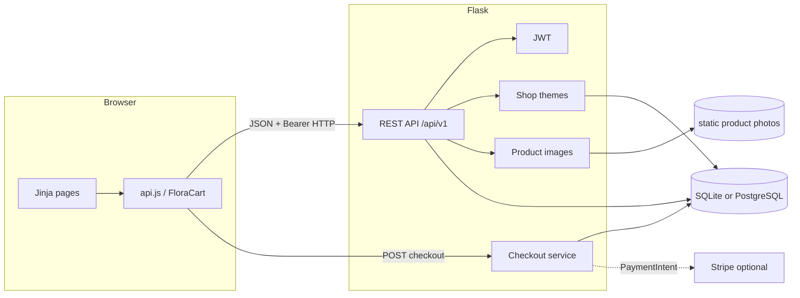
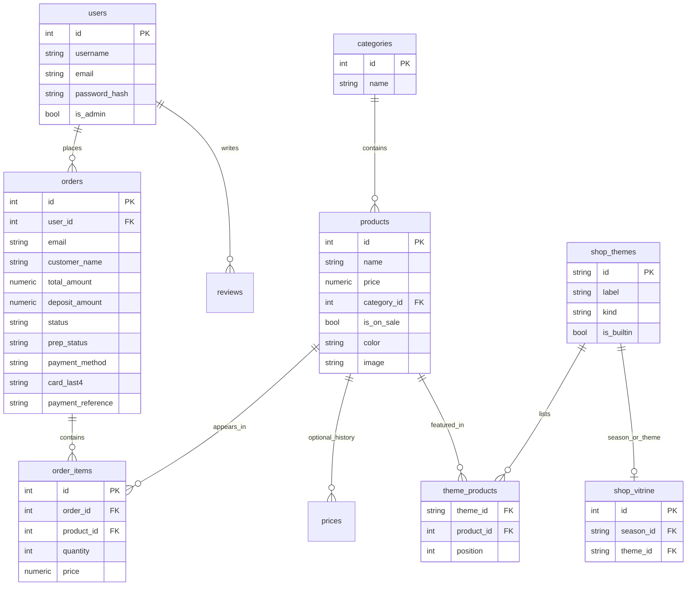
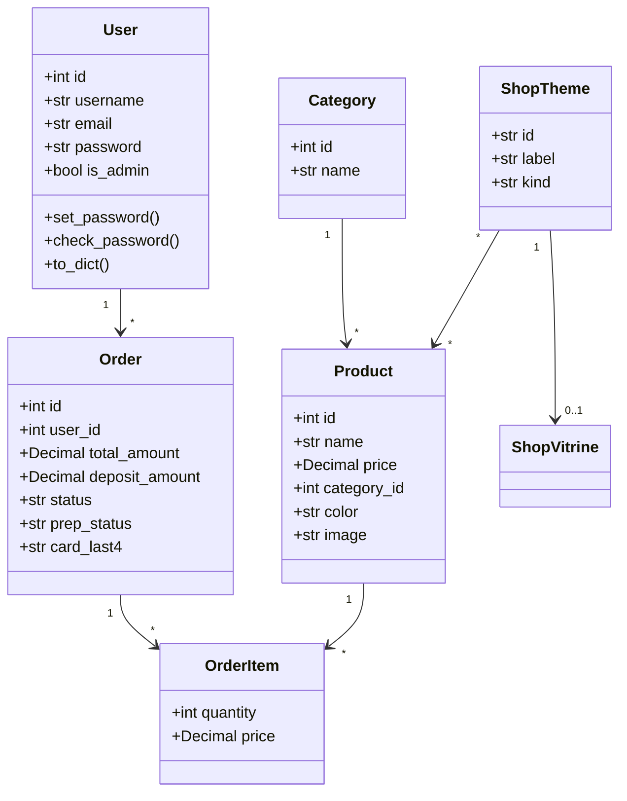

# Pivoine & Lilas

Online boutique for a family florist in Sciez (Léman, Haute-Savoie). Customers browse photographed bouquets, filter by category or colour, keep a private cart, pay online (full payment or a 30 % deposit), subscribe to a floral plan, and track workshop preparation. The florist manages the catalog, applies a season, an event theme, or both as a live shop vitrine, and reviews each paid order as a printable **FAC** document (TTC demo invoice — not a fiscal HT/TVA invoice).

The previous site was a Wix brochure that was no longer maintained. This repository is the working shop used for Holberton Demo Day.

Source: [github.com/Issercio/Demo-day](https://github.com/Issercio/Demo-day) · branch `main`

**Download the evaluation files**

| File | GitHub | Local shop |
| --- | --- | --- |
| Specifications (.docx) | [Pivoine-Lilas-Specifications.docx](docs/Pivoine-Lilas-Specifications.docx) | http://localhost:5000/downloads/Pivoine-Lilas-Specifications.docx |
| Presentation (.pptx) | [Pivoine-Lilas.pptx](docs/presentation/Pivoine-Lilas.pptx) | http://localhost:5000/downloads/Pivoine-Lilas.pptx |

Page with both buttons: http://localhost:5000/livrables.html

Testing: [`docs/testing.md`](docs/testing.md) · evidence [`docs/test-evidence/`](docs/test-evidence/)  
Postman: [`docs/postman/FloraShop.postman_collection.json`](docs/postman/FloraShop.postman_collection.json)

---

## Team

| Name | Role | Responsibilities |
| --- | --- | --- |
| Dimitri Jaille | Backend lead & full-stack | Flask API, SQLAlchemy, JWT, checkout, payments, tests, security, this README |
| Mattieu Mouroux | Frontend, product & Demo Day | Jinja/CSS/JS storefront, user stories, screens, live demonstration, presentation deck |

**Communication.** Daily work is visible on GitHub. We sync 15–30 minutes before each demo. Technical decisions that affect money or auth are written here and in the specification.

**Decisions.** Mattieu owns UI copy. Dimitri owns API, schema, and security. Cutting email, delivery zones, or inventing a 20 % TVA requires both of us and is listed under missing stories — never hidden.

---

## Problem and target users

**Problem.** The boutique still sold after 19:00 (birthdays, hotels, funeral pieces) while the public site was a Wix brochure: no cart, no account, no payment, no catalog the florist could update. Information lived on Instagram, the phone, and the street window.

**Users.** Marie Dupont (last-minute customer), Léa Martin (subscriber), Camille Pivoine (florist / admin).

**Pain.** No pay after closing time; phone orders without line items; no workshop status; seasonal windows not applied to the shop; demo carts leaked between accounts.

**Evidence.** Observation of the old Wix site; classroom bugs we actually fixed (empty checkout, bcrypt lockout on `marie@test.com`, client-trusted prices); local Léman florists and Interflora already take cards after hours; **80 automated tests** on the purchase path.

---

## Solution and value

A responsive **Flask + Jinja** shop with a REST API under `/api/v1`. Prices come from SQLAlchemy `Numeric(10, 2)` / `Decimal`, never from the browser. Optional Stripe when keys exist; the classroom demo uses documented test cards.

**Value.** Customers buy after closing time. The florist sees payment (`Payée` / `Acompte versé` / `Paiement refusé`) and atelier prep (`À préparer` → `Remise`). Demo Day runs in 20 minutes without Stripe secrets.

**MVP is green when** Marie pays for a photographed bouquet and Camille opens `FAC-YYYY-NNNN` and advances prep.

---

## Implemented features

### Mandatory core

| Feature | Status |
| --- | --- |
| Sign up | Done — `POST /api/v1/auth/register` |
| Login / sign out | Done — JWT in `localStorage`, **Déconnexion** |
| JWT | Done — HS256, 24 h, `Authorization: Bearer` |
| CRUD (catalog, themes, orders) | Done |
| External API | Done — optional Stripe PaymentIntent + webhook; test-card processor when keys are empty |
| Account verification by email/SMS | **Not shipped** — `verify-code.html` is UI only |
| Password change | **Partial** — `PUT /users/<id>` hashes a password but is admin-only; no customer form |

### Additional (more than ten, shop context)

Shopping cart · order management · workshop tracking (`Mes commandes`) · subscriptions · file upload · image management · admin dashboard · text search · category/colour/price filters · online payment · 30 % deposit · account deletion (self or admin) · customizable vitrine · Swagger/OpenAPI.

Invoices on the admin **Commandes et factures** screen are **TTC demonstration documents** (SIREN, FAC number, lines). There is no HT column and no invented 20 % TVA: the CGV has no VAT regime.

---

## MoSCoW

| Priority | Features |
| --- | --- |
| Must | Register/login/logout, catalog + photos, isolated cart, server checkout, admin guard, florist invoice + prep |
| Should | Subscriptions, 30 % deposit, Mes commandes, shop filters |
| Could | Season/event combo vitrine, custom event themes, optional Stripe, print window |
| Won’t (this release) | Native app, chat, AI, 2FA, OAuth, email, geo/click-and-collect, fiscal HT/TVA, mounted reviews |

---

## Implemented user stories

| ID | Role | Story | Priority |
| --- | --- | --- | --- |
| US-01 | Customer | Create an account so I can place orders | Must |
| US-02 | Customer | Log in / out so my cart and orders stay mine | Must |
| US-03 | Customer | Browse photographed bouquets by category | Must |
| US-04 | Customer | Filter by colour, price and name | Should |
| US-05 | Customer | Keep a cart that does not leak to another account | Must |
| US-06 | Customer | Pay online after closing time | Must |
| US-07 | Customer | Pay a 30 % deposit | Should |
| US-08 | Customer | Follow preparation on Mes commandes | Should |
| US-09 | Customer | Subscribe to a floral plan | Should |
| US-10 | Customer | Delete my account | Could |
| US-11 | Florist | CRUD products/categories and upload a photo | Must |
| US-12 | Florist | Apply a season, a theme, or both to the live shop | Could |
| US-13 | Florist | Create / delete event themes (not seasons) | Could |
| US-14 | Florist | Review a printable FAC (TTC) | Must |
| US-15 | Florist | Move prep À préparer → Remise | Must |
| US-16 | Florist | Keep the back-office for administrators only | Must |

Evidence: `/account.html`, `/shop.html`, `/checkout.html`, `/commandes.html`, `/subscription.html`, `/admin.html`, REST under `/api/v1`.

---

## Missing user stories

| Role | Story | Priority | Current state |
| --- | --- | --- | --- |
| Customer | Email / SMS account verification | Mandatory list | UI only |
| Customer | Change password from the account page | Mandatory list | Admin `PUT` only |
| Customer | Click-and-collect time slot | Must (original spec) | Paid order, no pickup window |
| Customer | Delivery limited to configured zones | Must (original spec) | No zone table |
| Customer | Email alerts for events and sales | Could | Password-reset pages are interface only |
| Florist | Edit homepage images and seasonal copy | Must (original spec) | Home is a template; vitrine applies to `/shop.html` |
| Florist | Configure delivery areas | Must (original spec) | Not modelled |
| Florist | Fiscal invoice HT + TVA | — | TTC demo FAC only |
| Customer | Write product reviews | Specified | `reviews` model exists; endpoints are not mounted |

---

## Getting started

Python 3.10+ is required. PostgreSQL is optional; SQLite is the default.

```bash
git clone https://github.com/Issercio/Demo-day.git
cd Demo-day
chmod +x setup.sh run.sh run-tests.sh
./setup.sh
./run.sh
```

`setup.sh` creates `Demoday/.venv`, installs `Demoday/requirements.txt`, copies `.env.example` to `Demoday/.env` if needed, and seeds demo users plus seven florist categories with product photos.

| Page | URL |
| --- | --- |
| Home | http://localhost:5000/accueil.html |
| Shop | http://localhost:5000/shop.html |
| Cart | http://localhost:5000/panier.html |
| Checkout | http://localhost:5000/checkout.html |
| My orders | http://localhost:5000/commandes.html |
| Admin | http://localhost:5000/admin.html |
| API (Swagger / OpenAPI) | http://localhost:5000/api/v1 |
| Specs + deck (download) | http://localhost:5000/livrables.html |

```bash
./run-tests.sh
```

### Environment

Copy [`.env.example`](.env.example) to `Demoday/.env`. Never commit `.env`.

| Variable | Example | Role |
| --- | --- | --- |
| `DATABASE_URL` | `sqlite:///florashop.db` | SQLAlchemy URI |
| `SECRET_KEY` | long random string | Flask and JWT signing (placeholders are refused) |
| `JWT_SECRET_KEY` | long random string | Reserved |
| `STRIPE_SECRET_KEY` | empty | Leave empty to use test cards |
| `STRIPE_PUBLISHABLE_KEY` | empty | Leave empty for the classroom demo |

### Demo accounts

| Role | Name | Email | Password |
| --- | --- | --- | --- |
| Customer | Marie Dupont | `marie@test.com` | `marie123` |
| Customer | Léa Martin | `client@test.com` | `client123` |
| Florist (admin) | Camille Pivoine | `admin@florashop.com` | `admin123` |

Successful payment: `4242 4242 4242 4242`, any future expiry, CVC `123`.  
Declined: `4000 0000 0000 0002`. Insufficient funds: `4000 0000 0000 9995`.

---

## Architecture



**Frontend.** Jinja templates, `static/css/style.css`, `static/js/api.js`. Vanilla JS — no React. Palette `#bc6288` / `#7f3f5a` / `#f8f5f2`.

**Backend.** `create_app()` wires CORS, SQLAlchemy, RESTX (`auth`, `products`, `categories`, `users`) and `payments`. Domain logic in `app/services/`.

**Deploy.** Classroom bind `0.0.0.0:5000`. No production host in this repository. Backup = SQLite file or managed PostgreSQL.

**Why this stack.** One process for Demo Day. RESTX gives Swagger. SQLite needs no ops. Decimal is the correct euro type. Test cards satisfy “external service” without live keys.

---

## Database

Money columns use `Numeric(10, 2)`. JSON still exposes numbers at the HTTP boundary; storage and totals are decimals.



`reviews` and `prices` exist as models but are not on the purchase path. Product `color` is `#rrggbb` (`VARCHAR(7)`). Card numbers are not stored.

### UML — use cases

Actors: **Guest** (browse, guest checkout, register), **Customer** (JWT, pay, track, delete account), **Florist** (catalog, vitrine, FAC, prep, list orders).

### UML — sequence (checkout 4242)

1. Customer submits card + `items[{product_id, quantity}]` (no trusted price).
2. `POST /api/v1/payments/checkout`. JWT optional; logged-in email overwrites the body.
3. `build_order_lines` loads `Product.price`. `payment_intent_id` → 400.
4. Luhn test card. `4242` → `paid` + `a_preparer`. `0002` → 402 `failed`.
5. `201` order JSON without Stripe PI. UI → `commandes.html#order-<id>`.

### UML — classes



---

## API

Interactive docs: http://localhost:5000/api/v1  
Error format: `{ "error": "…" }` or `{ "success": false, "message": "Accès refusé" }`.  
Auth: `Authorization: Bearer <jwt>`. Admin checks use the **database** `is_admin` column, not the JWT claim.

### Register (public)

`POST /api/v1/auth/register`

```json
{ "username": "Marie Dupont", "email": "marie@test.com", "password": "marie123" }
```

**201** `{ "success": true, "data": { "token": "<jwt>", "user": { "id", "username", "email", "is_admin" } } }`  
**400** validation. `is_admin` in the body is ignored. Password is never returned.

### Login (public)

`POST /api/v1/auth/login` — same envelope, **401** if invalid. Plaintext stored hashes are refused.

### Checkout (optional JWT)

`POST /api/v1/payments/checkout`

```json
{
  "email": "marie@test.com",
  "name": "Marie Dupont",
  "payment_method": "card",
  "card_number": "4242424242424242",
  "card_expiry": "12/34",
  "card_cvc": "123",
  "deposit": false,
  "items": [{ "product_id": 4, "quantity": 1 }]
}
```

**201** paid or deposit order. **402** declined (`failed` order attached). **400** empty cart, invalid card, or `payment_intent_id` present (use `/confirm-payment` with owner JWT instead).

### Other routes

| Method | Path | Auth | Purpose |
| --- | --- | --- | --- |
| GET | `/api/v1/products` | public | Catalog (`?theme=printemps,mariage`) |
| POST | `/api/v1/products` | admin | Create (JSON or multipart `image`) |
| PUT / DELETE | `/api/v1/products/<id>` | admin | Update / delete |
| GET | `/api/v1/categories` | public | List |
| POST / PUT / DELETE | `/api/v1/categories`… | admin | Mutate |
| GET | `/api/v1/themes` | public | Vitrine payload |
| PUT | `/api/v1/themes` | admin | Apply `{season, theme}` |
| POST / DELETE | `/api/v1/themes`… | admin | Event themes |
| GET | `/api/v1/users` | admin | List users (no password) |
| GET / DELETE | `/api/v1/users/<id>` | self or admin | Profile / account deletion |
| PUT | `/api/v1/users/<id>` | admin | Update (password hashed; cannot mint admin) |
| GET | `/api/v1/payments/config` | public | `test` or `stripe` |
| GET | `/api/v1/payments/my-orders` | JWT | Customer tracking |
| GET | `/api/v1/payments/orders/<id>` | owner or admin | Detail |
| GET | `/api/v1/payments/orders` | admin | All orders (`include_stripe`) |
| PATCH | `/api/v1/payments/orders/<id>` | admin | Prep or settle deposit |
| DELETE | `/api/v1/payments/orders/<id>` | admin | Remove (cascade items) |
| POST | `/api/v1/payments/create-payment-intent` | optional JWT | Stripe PI |
| POST | `/api/v1/payments/confirm-payment` | owner JWT | Stripe confirm |
| POST | `/api/v1/payments/webhook` | Stripe signature | Webhook |

**External API.** Stripe (`api.stripe.com`) when `STRIPE_SECRET_KEY` is a real `sk_test_`. Classroom leaves it empty.

---

## Non-functional requirements and security

- **SQL injection.** ORM and bound parameters. No concatenation of user input into SQL.
- **Hashing.** Werkzeug PBKDF2 with unique salt; legacy bcrypt verified; plaintext rows rejected.
- **Secrets.** `.env` gitignored; placeholder `SECRET_KEY` refused; `instance/secret_key` mode `0600`.
- **JWT.** HS256, `sub` / `email` / `is_admin` / `exp`. Role checks reload `users.is_admin`.
- **IDOR.** Orders owner-or-admin; `confirm-payment` owner; logged-in checkout overwrites email.
- **XSS.** `escapeHtml` on storefront/admin; colours must match `#rrggbb`.
- **Uploads.** Admin only, jpg/png/webp/gif, 4 MB, UUID names under `/static/img/products/`.
- **PAN.** Never stored; at most `card_last4`. Stripe `pi_` hidden from customer JSON.
- **CORS.** localhost only.
- **TLS.** Classroom HTTP. Production must use HTTPS. Cookie flags apply if cookies are introduced.
- **CNIL.** Salted hashes; demo passwords are classroom fixtures. **Gaps:** no brute-force lockout, no customer password-change form, no email verification — listed as missing.
- **Performance.** Catalog is tens of products; one `GET /products` then client filters. No pagination yet.
- **Responsive.** Sticky header in document flow; shop grid wraps; invoice layout stacks under 720 px.
- **Accessibility.** Form labels; keyboard buttons; admin notices instead of `alert()`.
- **Errors.** JSON `{error}` with 400/401/402/403/404/500. Flask debug off unless `FLASK_DEBUG=1`.
- **Backup.** SQLite file or managed PostgreSQL. Recovery: `./setup.sh`.

Remaining risks: JWT in `localStorage` (XSS), no CSRF on cookie-less Bearer, PayPal/saved-card sandboxes, bind `0.0.0.0:5000` for class.

---

## Git collaboration

- `main` is the stable demo.
- Feature branches, then PR, then merge when `./run-tests.sh` is green and `.env` is not in the diff.
- Commits: short imperative (`Show florist orders as printable invoices.`).
- Review: readable, no secrets, story matches, UI responsive if touched, API JSON consistent.
- Conflicts: resolve locally, re-run tests, never force-push `main`.
- Board: Backlog → In progress (branch) → Review (PR) → Done (`main`). Cards map to US-01… in the specification.

---

## Testing

Strategy and evidence: [`docs/testing.md`](docs/testing.md). Last captured run: **80 tests OK**.

Covered: registration hashing, demo seed, admin vs customer, uploads, checkout (success, decline, insufficient funds, Luhn, PayPal, saved card, 30 % deposit, prep PATCH, delete order, tracking, Decimal cents, IDOR, spoofed email), vitrine combos, forged JWT, placeholder secret, `payment_intent_id` rejected on public checkout, invalid product colour stored as null.

Not covered: live Stripe network, email, Playwright e2e, reviews, load.

Bugs found in testing (empty cart, bcrypt Marie, shared cart, float money, forged admin claim, season picker on home, sparse admin orders, Stripe PI reuse) are **fixed**. Open items are in the next section.

---

## Known bugs and limitations

Resolved: empty checkout cart; Marie bcrypt; shared cart; client prices; float money; fixed navbar; profile overlay; empty shop seed; vitrine moved off accueil; combo `+` ids; admin order cards/invoices; plaintext login rejected; stolen `pi_` on checkout; XSS tester `index.html`.

Open, none of them block a purchase:

- Forgot-password and verify-code pages do not send email
- Customer cannot change password from the UI
- Reviews API is not registered
- Cart lives in `localStorage`
- `prices` table unused
- Duplicate CSS and leftover debug prints
- No production host / TLS in this repository
- CORS allow-list is localhost
- Package coverage pulled down by unused modules
- FAC invoices are TTC demo documents, not tax invoices

---

## Challenges and how they were solved

| Challenge | Kind | Resolution |
| --- | --- | --- |
| Front-end and API disagreed on cart identity | Technical | One `FloraCart` helper, per-account keys, checkout snapshot |
| Mixed password hashes | Technical | Werkzeug + bcrypt; plaintext refused; seed repairs Marie |
| Stripe keys missing in class | Technical | Documented test cards |
| Money rounding | Technical | `Decimal` + `Numeric(10, 2)` |
| Season picker on the homepage | Product | Admin **Vitrine du shop**; public `GET /themes` |
| Fake TVA on invoices | Product | TTC only; legal line says demonstration |
| Rebuild every Wix page | Product | Cut CMS, geo, email; keep the purchase path |
| Twenty minutes including the live demo | Organisation | Timed Marie story; skip decline if the clock runs out |

---

## Collaboration evidence

- GitHub [Issercio/Demo-day](https://github.com/Issercio/Demo-day)
- [`docs/test-evidence/`](docs/test-evidence/)
- Swagger `/api/v1` and Postman
- Screenshots in [`docs/screenshots/`](docs/screenshots/)
- Specification and deck linked at the top of this file

Cadence for a demonstration: one local server, credentials above, tests + this README if a deploy is down.

---

## What we would improve

- Server-side cart
- Click-and-collect slots and delivery zones
- Real email (receipts, verification, reset) and CNIL lockout
- Hosted HTTPS and a recorded walkthrough
- Playwright and PostgreSQL in CI
- HT/TVA only if the CGV gains a VAT regime
- Remove or test leftover modules (`prices`, unmounted reviews)

---

## What we learned

**Technical.** Never trust a price from the browser. Store money as decimals. Support legacy hashes or the demo account locks. An empty Stripe key must not crash checkout. Secrets do not belong in Git. Combo ids must stay URL-safe. Do not invent TVA.

**Non-technical.** A demonstration needs a story, not a click tour. Missing stories must be listed or they look like defects. Twenty minutes including the demo forces cuts. Documentation is part of the product. Each of us can explain the shared checkout.

---

## Live demonstration (≤ 20 minutes)

Marie forgot her mother’s birthday. The boutique in Sciez is closed. She opens Pivoine & Lilas.

1. Home — boutique open online (no theme picker on accueil).
2. Florist `admin@florashop.com` / `admin123` → **Vitrine du shop** → **Printemps + Mariage**. `/shop.html` follows for every visitor.
3. Shop as Marie — filter, add **Bouquet Pivoine** (photo).
4. Sign in `marie@test.com` / `marie123`. Cart is hers. Profile menu does not stretch the navbar.
5. Pay `4242 4242 4242 4242`. Server total. `Payée` + `À préparer`. Optional 30 % deposit.
6. **Mes commandes** → **Voir le détail**. Stepper read-only.
7. Optional *Éclat Mensuel* €19.99. Optional declined `4000…0002`.
8. Florist **Commandes et factures**: `FAC-YYYY-NNNN`, TTC lines, **Imprimer la facture**, prep → `Remise`.

If the UI fails: Swagger `/api/v1` and `./run-tests.sh`.

---

## Mockups / screenshots

Fonts: Georgia / EB Garamond for titles, system sans for UI. Palette `#bc6288`, `#7f3f5a`, `#f8f5f2`, `#3a2a30`. The live CSS is the design system; Figma is not a separate source of truth.

| Page | Capture |
| --- | --- |
| Home | [accueil.png](docs/screenshots/accueil.png) |
| Shop | [shop.jpg](docs/screenshots/shop.jpg) |
| Shop vitrine | [shop-vitrine.jpg](docs/screenshots/shop-vitrine.jpg) |
| Cart | [panier.png](docs/screenshots/panier.png) |
| Account | [account.png](docs/screenshots/account.png) |
| Profile menu | [account-menu.png](docs/screenshots/account-menu.png) |
| Checkout | [checkout.png](docs/screenshots/checkout.png) |
| Admin vitrine | [admin-vitrine.png](docs/screenshots/admin-vitrine.png) |
| Admin catalog | [admin-catalog.png](docs/screenshots/admin-catalog.png) |
| Admin invoices | [admin-orders.png](docs/screenshots/admin-orders.png) |


---

## Conclusion

Pivoine & Lilas takes a real order after closing time. A customer can sign in, buy a photographed bouquet, pay or leave a deposit, subscribe, and follow the atelier. The florist manages the catalog, the vitrine, and a printable TTC invoice. The server owns the price. What is not built is listed here. The next work is operations, not another visual pass.

---

## Authors

- **Dimitri Jaille** — [github.com/Issercio](https://github.com/Issercio)
- **Mattieu Mouroux**
