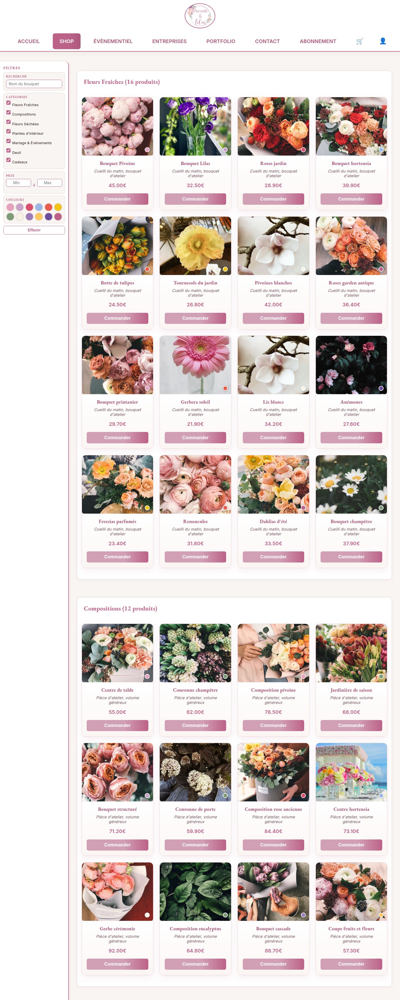
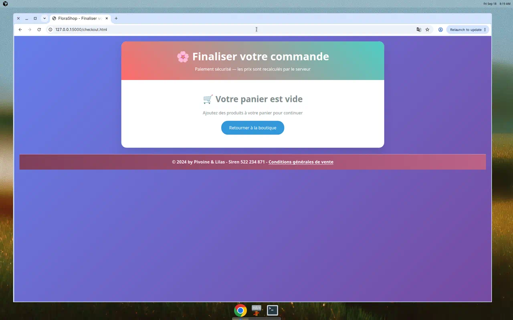
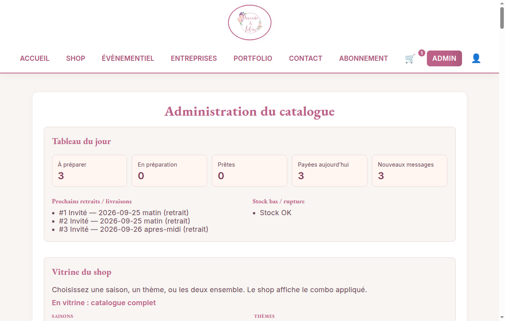
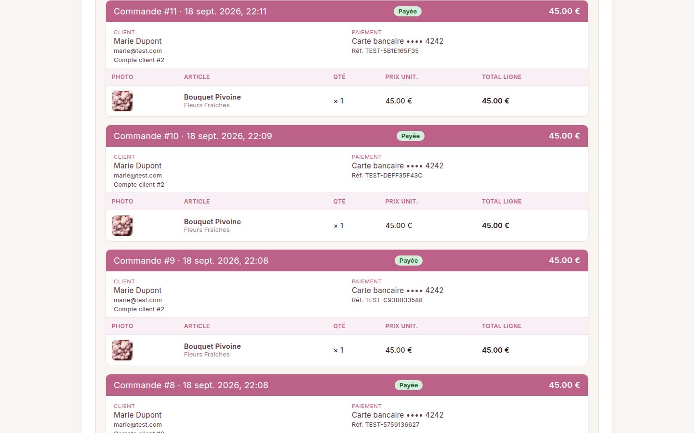

# FloraShop

Boutique florale en ligne : le client choisit un bouquet, paie, et suit sa commande. Le fleuriste gère le catalogue, la vitrine et l’atelier depuis un back-office protégé.


## Ce que fait le shop

**Côté client**
- Compte (inscription, vérification, mot de passe) ou achat en invité
- Catalogue photo : 7 univers (fleurs fraîches, compositions, séchées, plantes, mariage, deuil, cadeaux)
- Filtres par catégorie, couleur et prix
- Panier serveur, fusionné au compte à la connexion
- Paiement en ligne (cartes de test, ou Stripe si les clés sont renseignées)
- Acompte 30 % ou règlement intégral
- Date de retrait ou de livraison au paiement
- Abonnements mensuel, semestriel et annuel
- Suivi de commande (compte, ou invité avec email + n°) et facture
- Formulaire Contact : le message arrive dans l’inbox du fleuriste, qui peut répondre
- Livraison en Île-de-France (tarif et départements réglables) ou retrait atelier
- Code promo au paiement

**Côté fleuriste**
- Catalogue : créer, modifier, supprimer, photo produit, stock
- Vitrine du shop : une saison, un thème, ou les deux
- Tableau du jour : à préparer, stock bas / rupture, prochains retraits
- Demandes contact : nouveau → lu → traité, réponse au client
- Identité boutique, zones de livraison, jours fermés, codes promo
- Commandes : statut de paiement, préparation (`À préparer` → `Remise`), facture imprimable
- Accès admin réservé : un client ne peut pas ouvrir le back-office









## Lancer le projet

Python 3.10+. SQLite par défaut, PostgreSQL si `DATABASE_URL` le demande.

```bash
git clone https://github.com/Issercio/Demo-day.git
cd Demo-day
chmod +x setup.sh run.sh run-tests.sh
./setup.sh
./run.sh
```

Le shop écoute sur [http://localhost:5000](http://localhost:5000). HTTPS local : `./run-https.sh`. Tests : `./run-tests.sh`.

| Page | URL |
| --- | --- |
| Accueil | http://localhost:5000/accueil.html |
| Boutique | http://localhost:5000/shop.html |
| Panier | http://localhost:5000/panier.html |
| Paiement | http://localhost:5000/checkout.html |
| Commandes | http://localhost:5000/commandes.html |
| Contact | http://localhost:5000/contact.html |
| Admin | http://localhost:5000/admin.html |
| API | http://localhost:5000/api/v1 |

Copier [`.env.example`](.env.example) vers `Demoday/.env`. Ne jamais committer `.env`.

## Comptes de démonstration

| Rôle | Email | Mot de passe |
| --- | --- | --- |
| Client | `marie@test.com` | `marie123` |
| Client | `client@test.com` | `client123` |
| Fleuriste | `admin@florashop.com` | `admin123` |

Paiement accepté : `4242 4242 4242 4242`, date future, CVC `123`.  
Refusé : `4000 0000 0000 0002`. Fonds insuffisants : `4000 0000 0000 9995`.

Les totaux viennent de la base, jamais du navigateur. Les numéros de carte ne sont pas stockés (au plus les 4 derniers chiffres).

## Mettre en ligne

Le dépôt n’expose pas d’URL publique tant qu’un hébergeur n’est pas connecté. Deux chemins prêts :

**Docker Compose** (Postgres + gunicorn)

```bash
docker compose up --build
```

Le shop écoute sur [http://localhost:5000](http://localhost:5000). Le mot de passe Postgres d’exemple est dans `docker-compose.yml` : à changer hors démo.

**Render** — le fichier `render.yaml` décrit le service. Relier le dépôt GitHub à Render, déployer, et l’URL Render devient l’adresse du shop. Poser `SECRET_KEY` (générée) et éventuellement les clés Stripe.

## Technique

| Couche | Choix |
| --- | --- |
| Front | HTML, CSS, JavaScript, Jinja2 |
| API | Flask 3, Flask-RESTX |
| Auth | JWT, mots de passe hashés, verrouillage après 5 échecs |
| Données | SQLAlchemy 2, `Numeric(10, 2)` pour l’argent |
| Paiement | Processeur de test, Stripe optionnel |
| Prod | gunicorn, Docker, Render |

Le navigateur affiche les pages et appelle `/api/v1`. La vitrine lue par le shop est celle posée par le fleuriste (`GET /api/v1/themes`). Le logo est servi en local (`/static/img/logo.png`), pas depuis un CDN.

## Tests

La suite reste dans `Demoday/tests/` (`test_accounts.py`, `test_admin_guard.py`, `test_checkout.py`, `test_shop_ops.py`, `test_shop_commerce.py`).

```bash
./run-tests.sh
```

Détail et preuves : [`docs/testing.md`](docs/testing.md).

## API principale

Documentation interactive : [http://localhost:5000/api/v1](http://localhost:5000/api/v1)

| Méthode | Chemin | Qui |
| --- | --- | --- |
| POST | `/api/v1/auth/register` · `/login` · `/verify` | public |
| GET | `/api/v1/products` · `/categories` · `/themes` | public |
| GET / PUT / DELETE | `/api/v1/cart` | public (header `X-Cart-Token`) ou JWT |
| POST | `/api/v1/contact` | public |
| GET / PATCH | `/api/v1/contact` | fleuriste |
| GET | `/api/v1/atelier/today` | fleuriste |
| GET / PUT | `/api/v1/settings` | public / fleuriste |
| GET | `/api/v1/shipping` · `/promo/quote` | public |
| GET / POST / PATCH | `/api/v1/promos` | fleuriste |
| POST | `/api/v1/payments/checkout` | public ou JWT |
| POST | `/api/v1/payments/track` | public (email + n°) |
| GET | `/api/v1/payments/my-orders` | client |
| GET / PATCH | `/api/v1/payments/orders` | fleuriste |
| POST / PUT / DELETE | `/api/v1/products` · `/themes` · `/categories` | fleuriste |

## Auteur

[Dimitri Jaille](https://github.com/Issercio)
