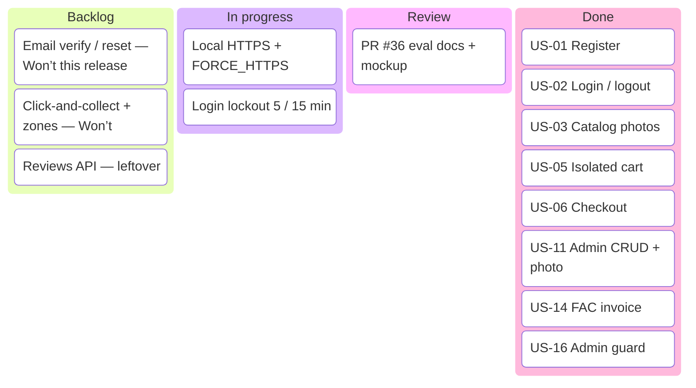

# Project board — Pivoine & Lilas

GitHub Projects n’est pas activé sur ce dépôt (API 403). Le board d’évaluation vit ici et suit les **pull requests** : colonne = état Git.

Columns: **Backlog** → **In progress** (branche `cursor/…`) → **Review** (PR) → **Done** (`main`).

| Card | Type | Owner | Priority | State |
| --- | --- | --- | --- | --- |
| US-01 Register | Story | Dimitri | Must | Done (`main`) |
| US-02 Login / logout | Story | Dimitri | Must | Done |
| US-03 Catalog + photos | Story | Mattieu | Must | Done |
| US-04 Filters | Story | Mattieu | Should | Done |
| US-05 Isolated cart | Story | Dimitri | Must | Done |
| US-06 Checkout | Story | Dimitri | Must | Done |
| US-07 30 % deposit | Story | Dimitri | Should | Done |
| US-08 Mes commandes | Story | Mattieu | Should | Done |
| US-09 Subscriptions | Story | Mattieu | Should | Done |
| US-10 Delete account | Story | Dimitri | Could | Done |
| US-11 Admin catalog | Story | Both | Must | Done |
| US-12 Vitrine combo | Story | Both | Must | Done |
| US-13 Event themes | Story | Dimitri | Must | Done |
| US-14 FAC invoice | Story | Dimitri | Must | Done |
| US-15 Prep stepper | Story | Dimitri | Must | Done |
| US-16 Admin guard | Story | Dimitri | Must | Done |
| HTTPS / TLS | Tech | Dimitri | Must (NFR) | Review |
| CNIL login lockout | Tech | Dimitri | Must (NFR) | Review |
| README + mockup | Tech | Both | Must | Review (PR #36) |
| Email verification | Story | — | Mandatory list | Backlog / Won’t this demo |
| Delivery zones | Story | — | Must original spec | Backlog / Won’t |

Assignments: Dimitri = API, money, security, tests. Mattieu = storefront, demo, deck.
